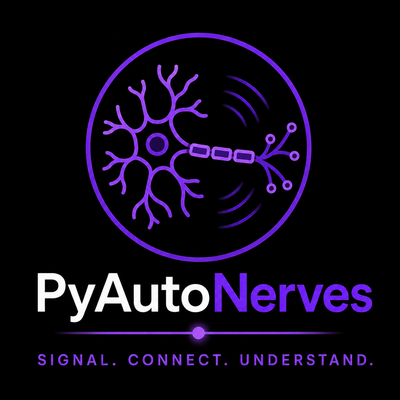

<p align="center">
  
</p>

# PyAutoNerves

🧬 **PyAutoScientist → <https://github.com/PyAutoLabs/PyAutoScientist>** — this repo is one organ of the PyAuto organism.

📖 **Full documentation → <https://pyautoscientist.readthedocs.io>** — the whole PyAutoScientist organism, including how to fork and run your own.

**PyAutoNerves** (package `autonerves`) is the configuration, serialization, and
I/O foundation of the [PyAuto](https://github.com/PyAutoLabs) ecosystem. It
provides a layered configuration system with workspace overrides, dict / JSON /
CSV serialization of arbitrary objects, and FITS I/O.

`PyAutoFit`, `PyAutoArray`, `PyAutoGalaxy`, and `PyAutoLens` all depend on
autonerves: it supplies their packaged default config, the object-serialization
used to persist models and results, and shared utilities (`test_mode`,
`jax_wrapper`). Centralising these here keeps a single, consistent config and
I/O layer beneath every library. Within the
[PyAutoScientist organism](https://pyautoscientist.readthedocs.io) it is the
Nerves — the layer connecting the workspace's conventions to every library.

## Install

```bash
pip install autonerves
```

## Examples

Layered config — read a directory of YAML into a queryable `Config`:

```python
from autonerves.conf import Config

config = Config("path/to/config")          # directory of YAML files
value = config["general"]["model"]["section"]["value"]
```

JSON serialization — round-trip arbitrary Python objects:

```python
from autonerves.dictable import output_to_json, from_json

data = {"sersic_index": 4.0, "centre": [0.0, 0.0]}
output_to_json(data, "model.json")
restored = from_json("model.json")         # == data
```

FITS I/O — write and read a NumPy array:

```python
import numpy as np
from autonerves.fitsable import output_to_fits, ndarray_via_fits_from

arr = np.arange(12.0).reshape(3, 4)
output_to_fits(values=arr, file_path="demo.fits", overwrite=True)
loaded = ndarray_via_fits_from(file_path="demo.fits", hdu=0)   # np.allclose(arr, loaded)
```

## Links

- Source & tests: [`autonerves/`](autonerves), [`test_autonerves/`](test_autonerves)
- Agent/contributor instructions: [`AGENTS.md`](AGENTS.md)
- Ecosystem: [PyAutoLabs on GitHub](https://github.com/PyAutoLabs)
